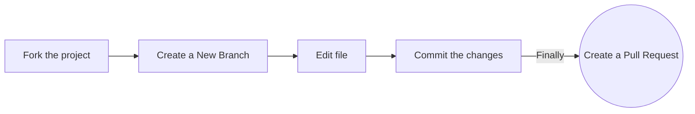

# Event Countdown Timer

 <!-- Replace with an actual image link -->

## Overview

Welcome to the **Event Countdown Timer** project! This web application allows users to create and manage multiple countdown timers for their events. Whether it's a birthday, an anniversary, or any significant occasion, you can keep track of your events easily. This project is aimed at promoting open-source contributions as part of **Hacktoberfest 2024**.

## Features

- **Multiple Event Timers**: Add as many events as you want with custom names and countdown times.
- **Real-Time Countdown**: Timers update dynamically, providing real-time countdowns to your events.
- **Responsive Design**: Works seamlessly on both desktop and mobile devices.
- **Hacktoberfest Celebration**: Includes a footer dedicated to Hacktoberfest, encouraging contributions to open-source.

## Technologies Used

- HTML
- CSS
- JavaScript

### Option 1. Complete this process in GitHub (in your browser)



**1. Fork the project:**

- Click the gray <kbd>Fork</kbd> button at the top right of the previous page. This creates your copy of the project and saves it as a new repository in your GitHub account.

**2. Create a New Branch:**

- On your new repository's page, click the gray main button in the upper left to reveal a dropdown menu.
- Enter the name of your new branch in the text box. (Branch names usually refer to what is being changed. Example: nameAdd).
  -Click on Create branch <new branch name>, which will automatically take you to your new branch. You can make edits on the main branch, but this may cause issues down the line. The best practice is to create a new branch for each separate issue you work on. That way your main branch remains in sync with proejects main branch.

**3. Edit:**

- Make the required changes to the code as per the issue told

**4. Raise a Pull Request:**

- Click `Pull Requests` option in your forked repository (which is the third option at the top of this page after the options `Code` and `Issues`).
- Click the green New Pull Request button. This will prep the new pull request for you by auto-filling the base repository: base with 'GssocCommunity: main' AND auto-filling your head repository: compare with your repository: main
- Click on your head repository's `compare` dropdown, and switch branches from your 'main' branch to `<new branch name>`.
- Finally, click the green `Create Pull Request` button. Great job! You did it!

You can ask questions by raising an issue.

### Option 2. Complete this process on your computer (locally)

**1. Fork the project:**

- Click the gray <kbd>Fork</kbd> button at the top right of the previous page. This creates your copy of the project and saves it as a new repository in your GitHub account.

**2. Clone this project on your computer:**

- Go to your profile. You will find forked repo named **eventTimer**. go to the repo by clicking on it.
- Click on the green Code button, then either the HTTPS or SSH option, and, click the icon to copy the URL. Now you have a copy of the project. Thus, you can play around with it locally on your computer.

```bash
  git clone https://github.com/GSSoC24/being-an-GSSoc24.git
```

- Switch to the cloned folder. You can paste this command into the same terminal window. 


```bash
  cd being-an-GSSoc24
```

**3. Open in code Editor:**

- Open the README.md File:
Use your code editor (like VS Code) to open the README.md file.

<!-- Replace with your own image -->

  
**4. Create a new branch:**

- A branch name can represent the changes you're making (e.g., add-event-timer-feature). A good practice is to use your GitHub username for the branch name to make it unique.

<!-- Replace with your own image -->

- To create a new branch, run the following command in your terminal:

```bash
  git checkout -b <name-of-new-branch>
```

**5. Edit the File:**
<!-- Replace with your own image -->

- **Make the required changes to the code as per the issue told**

- For example
  `- [Full Name](https://github.com/your-username)`

**5. Stage your changes:**

```bash
  git add README.md
```

or

```bash
  git add .
```

**6. Commit the changes:**

```bash
  git commit -m "Add <your-github-username>"
```

- Check the status of your repository.

```bash
  git status
```

- The response should be like this:
add image

```bash
On branch <name-of-your-branch>
nothing to commit, working tree clean
```

**7. Pushing your repository to GitHub:**

```bash
  git push origin <name-of-your-branch>
```

or

```bash
  git branch -M main
  git push -u origin main
```


> **Warning**: If you get an error message like the one below, you probably forgot to fork the repository before cloning it. It is best to start over and fork the project repository first.

```bash
ERROR: Permission to https://github.com/Hacktoberfest-Event-Timer/eventTimer.git denied to <your-github-username>.
fatal: Could not read from remote repository.
Please make sure you have the correct access rights and that the repository exists.
```

**8. Raise a Pull Request:**

- On the GitHub website, navigate to your forked repo - on the top of the files section, you'll notice a new section containing a `Compare & Pull Request` button!

- Click on that button, this will load a new page, comparing the local branch in your forked repository against the main branch Hacktoberfest Event Timer repository. Do not make any changes in the selected values of the branches (do so only if needed), and click the green `Create Pull Request` button. 
  Note: A pull request allows us to merge your changes with the original project repo.

- Your pull request will be reviewed and then eventually merged.

Hurray! You successfully made your first contribution! 🎉

---

## How can I fix a merge conflict?

A GitHub conflict is when people make changes to the same area or line in a file. This must be fixed before it is merged to prevent collision in the main branch.

- **To read more about this, go to [GitHub Docs - About Merge Conflicts](https://docs.github.com/en/github/collaborating-with-pull-requests/addressing-merge-conflicts/about-merge-conflicts)**

- **To find out about how to fix a Git Conflict, go to [GitHub Docs - Resolve Merge Conflict](https://docs.github.com/en/github/collaborating-with-pull-requests/addressing-merge-conflicts/resolving-a-merge-conflict-on-github)**


